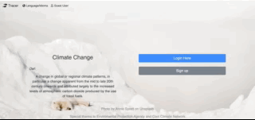
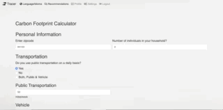
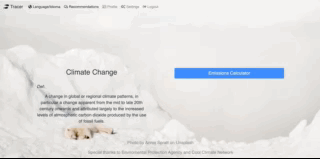

# Tracer 

## Summary 

**Tracer** is a resourceful and efficient web app that allows users to calculate the amount of carbon emissions they released throughout the year. This will be based on the amount of travel (both daily commute and air travel), food consumption, waste, clothes, and electricity. Tracer has a user recommendation section, that allows users to comment what they do to decrease their carbon footprint. All these features can be viewed in english or in spanish. 

## About the Developer
Tracer was created by Alejandra Lopez. Learn more about the developer on [Linked In](https://www.linkedin.com/in/alejandra-lopez-0a0a205b/).

## DEMO Video 
[DEMO](https://drive.google.com/file/d/1z0TKpaBW8NxHGx1xa6zF3t-fe1LtIPQS/view?usp=sharing)

## Technologies

### Tech Stack:

#### Front end
* Jinja2
* HTML
* CSS
* Javascript
* JQuery
* AJAX
* Bootstrap

#### Backend
* Python
* Flask
* Babel
* SQLAlchemy
* JSON
* Python unittest module

## Features








#### Requirements:

- PostgreSQL
- Python 3.6

To have this app running on your local computer, please follow the below steps:

Clone repository:
```
$ git clone https://github.com/alemarlo1992/carbon_footprint_calc
```
Create a virtual environment:
```
$ virtualenv env
```
Activate the virtual environment:
```
$ source env/bin/activate
```
Install dependencies:
```
$ pip install -r requirements.txt
```
## TODO
* Send users weekly recommendations 
* Allow users to share on social media 
* Allow users to comment on other users recommendations


